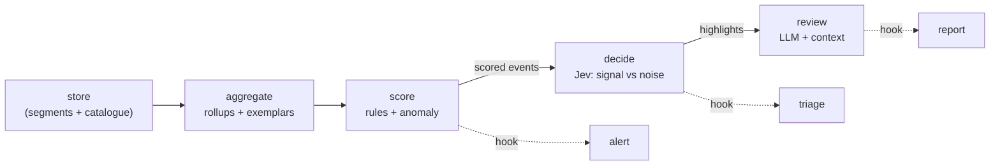

# The guest monitor's host side: storage, filtering, the analysis pipeline and hooks

Status: **design**, 2026-10-04. Builds on [ADR-0031](./adrs/0031-a-root-collector-in-the-guest.md)
(slices 1–2: Tetragon in the VM, the signed spool, the host pull and join). What is built today:
the hook mechanism (§6). Everything else here is proposed, with the measurements it rests on.

## 1. What the events look like

From the slice-2 live runs on a Lima `template:podman` guest (Fedora 44, Tetragon v1.7.1,
`fy-observe` policy, `enable-process-ns`), a VM with a box and a stack, under QEMU TCG:

- **~7 events/s at rest**, ~2.1 KB each as stored (the full Tetragon event: the process, its
  parent, eleven namespaces). About **25 MB/hour** raw.
- **60% of events are process exits.** The single largest source is `pasta` exiting (14%); then
  shell plumbing — `readlink`/`basename`/`ln`/`rm`/`grep`/`grepconf.sh` — from login shells and
  Lima's own boot scripts.
- **The monitor watched itself three times** before it was fixed: the policy covered the spool
  (fixed: inbox only), every pull logged in afresh (fixed: one multiplexed ssh connection), and
  each pull still runs `bash`, `find`, `sort`, `stat`, `tail` in the VM — ~120 events a pull,
  still open (§4).

## 2. Storage: what was measured

The same real records (9,692 from a clean boot; 72,001 from all runs) stored six ways. Sizes are
on disk; "q" is a two-minute time-window count and a group-by on binary × kind:

| store | B/event (clean / all) | ingest | q window / group-by | memory to open | install |
| --- | --- | --- | --- | --- | --- |
| JSONL, as today | 2,108 / 2,116 | — | full scan | — | stdlib |
| JSONL + zstd-3 stream | 52 / 24 | fast | full scan (decompress) | — | `zstandard` |
| JSONL, **zlib per 1,000-row batch** | **69 / 39** | 180–240 MB/s | per batch | — | **stdlib** |
| JSONL, lzma-6 | 39 / 17 | 12–20 MB/s | full scan | — | stdlib |
| SQLite, raw JSON + columns | 3,170 / 3,944 | 0.5 / 5 s | 0.3 ms / 18–142 ms | 11 MB | stdlib |
| SQLite, zstd per row | 939 / 1,044 | 0.2 / 2.9 s | 0.2 ms / 6–55 ms | — | `zstandard` |
| **chDB** 4.4.0, MergeTree, ZSTD(3) columns | **119 / 89** | 2.1 / 3.9 s | 5 ms / 4–8 ms | **403 MB** | **534 MB** + pandas + pyarrow |
| DuckDB 1.5.6 | (not sized) | | | 56 MB | ~25 MB |

**chDB is a strong analytical engine and a poor fit as foldyard's store**, for three reasons that
the measurements and its own docs agree on:

1. **One process per data directory.** A second process opening a store a writer holds is
   refused (`Cannot lock file …/status. Another server instance in same directory is already
   running`) — tested, and documented upstream (one data path per process; a session-level
   lock). The supervisor writes continuously, so `fy monitor`, the TUI and any hook would all
   have to read *through* the supervisor over IPC. DuckDB behaves the same way (a read-only
   open is refused while a writer holds the file).
2. **Footprint.** 403 MB resident just to open a session — in a supervisor that today runs in
   tens of MB — and 534 MB on disk plus pandas and pyarrow, for every foldyard install.
3. **It doesn't compress better than the standard library here.** MergeTree with ZSTD columns
   stored 89–119 B/event; zlib over 1,000-row batches of the same JSON stored 39–69 B/event. The
   records are highly repetitive JSON, and batch compression captures that as well as columns
   do.

What chDB (or DuckDB) *is* good for: querying immutable compressed files without owning them.
Both read gzip'd JSONL directly (`file('…/*.jsonl.gz', JSONEachRow)`), with no lock — so they fit
as an **optional engine for the analysis stages** (§5), not as the store.

**Proposed store — stdlib only:**

- **Segments:** append-only `JSONL` files, one per hour per tier, each batch the pull stores
  written as one gzip *member* (a valid gzip stream grows member by member; `zcat`, Python's
  `gzip`, chDB and DuckDB all read it). Closed segments are immutable. ~40–70 B/event.
- **A SQLite catalogue** beside them (WAL mode: one writer, any number of readers, including
  while the writer writes): which segments exist and what they cover, the rollups (§3), the
  exemplars, and each hook's cursor. Small, indexed, and the thing `fy monitor`/the TUI query.
- The supervisor is the only writer; every reader opens files and the catalogue read-only.

## 3. Tiers and retention

Budget: **1 GB per project** (configurable), at ~40–70 B/event compressed ≈ 15–25 M events of
full-fidelity history if nothing were thinned. Tiers, each a set of segments:

| tier | keeps | how long |
| --- | --- | --- |
| **everything** | every stored record: events, snapshots, gaps, engine claims | 8 h of activity |
| **most** | everything except the classes in §3.1 | 24 h of activity |
| **aggregates** | rollups per hour × worktree × container name × kind × binary (× destination for connects, × path for files): count, first/last seen, distinct args | until the budget |
| **exemplars** | the raw record of every event the aggregation found off-distribution (§3.2) | forever (own small budget, oldest-first beyond it) |

**Activity, not wall-clock.** Retention counts *hours in which events arrived*, and pruning runs
only at ingest — never on a timer. A finished session followed by silence keeps full fidelity
however long the silence lasts; it ages only as new activity accumulates behind it. (Alternative
considered: wall-clock age, pruned only when new events arrive — simpler, but the first event
after a weekend would prune the whole previous session at once.)

**Budget pressure** prunes in order: `everything` beyond 8 h → `most` beyond 24 h → aggregates,
coarsened (hour → day) from the oldest → exemplars beyond their own cap. Never the current hour.

### 3.1 "Everything" vs "most" — proposal

`most` drops what is high-volume and nearly never the question, and keeps every event that names
a security-relevant action:

- **dropped:** exits with status 0 and no signal (60% of all events; the exec is kept, so "what
  ran" survives — only "it finished normally" is lost), and `vm`-namespace plumbing execs whose
  binary *and* parent are on a short, packaged list (shell init helpers under a login shell,
  podman/conmon/crun internals).
- **always kept:** every exec in a container or `unattributed`; every connect; every file event;
  non-zero exits and signals; snapshots, gaps, forgeries, engine claims.

Expected: roughly a third of the raw volume. To be checked against real sessions before it's
the default.

### 3.2 Off-distribution exemplars

Kept forever, from what the aggregation sees, per worktree (and, where it holds, per container
name — a claim, so never the only key):

- first time a binary runs; first destination (IP:port, later joined to the proxy's hostname);
  first touch of a watched path; first `unattributed` container;
- a count far above that key's rolling hourly baseline (e.g. > p99 of the last 7 active days);
- every refused file access, every gap, every forged line.

Each exemplar keeps a little context: the records ±N seconds around it from the same container,
so a later review sees what led up to it.

## 4. Filtering at source

Tetragon filters its export before anything is written (`export-denylist`: binary, parent and
ancestor binary, arguments, event type, CEL expressions) and can strip fields from what it keeps
(`field-filters`). Proposed defaults, packaged with the policy (so a change re-provisions the VM,
and an invalid filter stops Tetragon — validated in the host-tier e2e like the policy):

- **The monitor's own transport:** the pull runs one packaged reader
  (`/usr/local/libexec/fy-monitor-spool`, installed by the boot script) instead of a shell
  pipeline, and that reader and its `bash -c` wrapper are denied by argument match. Removes the
  last self-observation loop (~120 events per pull).
- **`pasta` exits** (14% of events; `pasta` is rootless networking plumbing — its *connects* are
  kept, they are the real egress).
- **Fields:** keep `process.ns.mnt` (attribution needs it) and drop the other ten namespaces;
  keep the parent's `exec_id` and `binary`, drop the rest of the parent object. Roughly halves an
  event before compression.

Not filtered at source: anything in a container. Source filters are lossy and can't be revisited;
thinning beyond plumbing belongs to the tiers, where `everything` still has it for 8 h.

## 5. The analysis pipeline



1. **Aggregate** (deterministic, in the supervisor): rollups and exemplars as in §3.
2. **Score** (deterministic first): rules — direct egress from a container (a proxy-bypass
   attempt; refused when the VM firewall is on), sensitive-file reads, refused accesses, forged
   lines, gaps — plus simple anomaly scores against each key's baseline. Output: the event, a
   score, and the reasons. Arithmetic and baselines stay in code (plan §8F).
3. **Decide** (a decision model, e.g. Jev's typed Choice/Score outputs): narrow questions over a
   compact bundle — the scored event, its exemplar context, the worktree's recent rollups, and
   trusted task context where it exists — with an explicit *insufficient evidence* answer.
4. **Review** (an LLM): the decision model's highlights with a little more context around each,
   written up for a person.

**Trust:** every string in an event — arguments, paths, binary names — is chosen by whatever ran
in the box. Stages 3 and 4 receive it as quoted data inside a fixed frame, never as instructions;
the evaluation (plan §8F) includes adversarial text in filenames and arguments. Names and
worktrees are claims (ADR-0031) and are labelled as such in every bundle.

None of stages 2–4 is built. Each is reachable today through a hook.

## 6. Hooks (built)

A hook is the operator's program or endpoint, called with batches of attributed events. It is
how a scoring script, a decision model or a notifier plugs in without being part of foldyard.

**Configuration is host-only**: `~/.foldyard/<project>/monitor-hooks.toml`, never
`foldyard.toml`. Repo config is writable by anything in the box: a `command` there would be host
code execution for the box (ADR-0023), and a `url` there would send every event wherever the
box chose. The file is read fresh each round; there is nothing to adopt.

```toml
[[hook]]
name = "score"                      # unique; keys the hook's cursor
command = ["/usr/local/bin/fy-score", "--json"]   # argv, absolute path, no shell
# or: url = "https://hooks.example.org/fy"      # POST, JSON body
# headers = { Authorization = "Bearer …" }      # url hooks only
stage = "events"                    # the only stage today; later: scored, decided, reviewed
kinds = ["exec", "connect", "file"] # optional filters; omitted = all
who = ["container", "unattributed"]
worktrees = ["main"]
timeout = 15                        # seconds
```

- **Payload** (stdin for a command, the body for a url): `{"schema": "fy.monitor.events/1",
  "project", "hook", "events": [...], "first": [boot, seq], "last": [boot, seq]}` — the same
  `Event` fields `fy monitor --json` prints.
- **Settled events only**: an event is delivered once a snapshot after it exists (or two minutes
  have passed), so its attribution won't change.
- **At-least-once:** a hook's cursor advances only when a batch succeeded (exit 0, or HTTP 2xx).
  A failing batch is retried with backoff and, after five attempts, skipped and recorded.
- **Isolation:** commands run with a minimal environment (`PATH`, `HOME`, `LANG`, `FY_PROJECT`,
  `FY_HOOK`) — never the supervisor's, which holds every `host.env` secret — on their own thread,
  so a slow hook never delays the pull.

## 7. Open questions

1. **Retention clock:** active-hours (proposed) or wall-clock-pruned-on-ingest?
2. **"Most":** is dropping clean exits plus packaged plumbing the right default, or should `most`
   also drop `vm` execs generally?
3. **Exemplar thresholds:** the p99-of-7-active-days baseline is a placeholder; real sessions
   should set it.
4. **Where scoring runs:** in the supervisor (cheap, always on) or as a hook (replaceable)?
   Proposed: the deterministic rules in the supervisor, models behind hooks.
